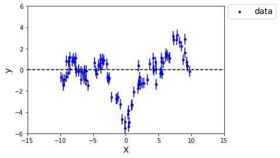
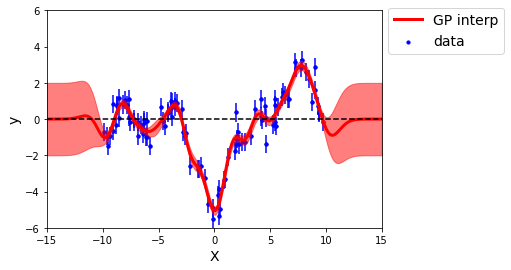

################
Gaussian Process interpolation
################

1D interpolation example
========================

Before showing how to perform a one dimentional interpolation using
``treegp``, a one dimentional gaussian random field is generated as an
example of data that could be interpolated using a Gaussian Process
regression. A gaussian random field :math:`y` is define as:

:math:`y \sim {\cal{N}}(0, K)`

where :math:`K` is the kernel. For this specific example I will used the
classic Radial Basis Function kernel (RBF in the following also know as
squarred exponential/gaussian kernel):

:math:`K(x_i, x_j) = \sigma^2 \exp\left( - \frac{1}{2} \frac{(x_i-x_j)^2}{l^2}\right)`

Where :math:`\sigma^2` is the variance of :math:`y` and :math:`l` the
correlation length of :math:`y`.

``treegp`` share the same API for kernel definition as ``scikit-learn``.
So any ``scikit-learn`` kernel would work in ``treegp``.

Consequently here is an example of how to generate a one dimentional
gaussian random field using ``numpy`` and ``scikit-learn``.

.. code:: ipython3

    import matplotlib.pyplot as plt
    from sklearn.gaussian_process.kernels import RBF
    import numpy as np
    
    def make_1d_grf(kernel, noise=None, seed=42, npoints=40):
        """
        Function to generate a 1D gaussian random field for a 
        given scikit-learn kernel.
        
        :param kernel:  given sklearn kernel.
        :param noise:   float. Level of noise to add to the 
                        gaussian randomn field. (default: None)
        :param seed:    int. seed of the random process. (default: 42) 
        :param npoints: int. number of points to generate for the 
                        simulations.
        """
        # fixing the seed
        np.random.seed(seed)
        # generate random 1D coordinate
        x = np.random.uniform(-10,10, npoints).reshape((npoints,1))
        # creating the correlation matrix / kernel 
        K = kernel.__call__(x)
        # generating gaussian random field
        y = np.random.multivariate_normal(np.zeros(npoints), K)
        if noise is not None:
            # adding noise
            y += np.random.normal(scale=noise, size=npoints)
            y_err = np.ones_like(y) * noise
            return x, y, y_err
        else:
            return x, y, None
    
    kernel = 2**2 * RBF(1)
    x, y, y_err = make_1d_grf(kernel, noise=0.5, npoints=100)
    
    plt.figure()
    plt.scatter(x, y, c='b', s=10, label='data')
    plt.errorbar(x, y, yerr=y_err, linestyle='',
                 marker='.', color='b', zorder=0)
    plt.plot([-15,15],[0,0], 'k--')
    plt.xlim(-15,15)
    plt.ylim(-6,6)
    plt.xlabel('X', fontsize=14)
    plt.ylabel('y', fontsize=14)
    plt.legend(fontsize=14, loc=(1.02,0.9))

And here an example of how to interpolate this data using ``treegp``
without optimizing hyperparameters:

.. code:: ipython3

    import treegp

    # treegp will take a sklearn like kernel
    # but in a string format.
    kernel = "2**2 * RBF(1)"
    
    # init here, take the kernel, no hyperparameters optimization
    # will be done (optimizer='none'), and normalize=False means
    # that no constant mean function is took into account.
    gp = treegp.GPInterpolation(kernel=kernel, optimizer='none', normalize=False)
    
    # load the data
    gp.initialize(x, y, y_err=y_err)
    
    # fit hyperparameters, however, as optimizer='none',
    # will do nothing and will use the given hyperparameters,
    # of the given kernel.
    gp.solve()
    
    # get the gaussian process interpolation, and associated
    # covariance. If you are familiar with sklearn gaussian process
    # interpolation, you should be aware for one dimentional interpolation
    # it will take column and not row.
    new_x = np.linspace(-15, 15, 200).reshape((200,1))
    y_predict, y_cov = gp.predict(new_x, return_cov=True)
    y_std = np.sqrt(np.diag(y_cov))
    
    # plot data/gp interpolation
    plt.figure()
    plt.scatter(x, y, c='b', s=10, label='data')
    plt.errorbar(x, y, yerr=y_err, linestyle='',
                 marker='.', color='b', zorder=0)
    plt.plot(new_x, y_predict, 'r', lw='3', label='GP interp')
    plt.fill_between(new_x.T[0], y_predict-y_std, 
                     y_predict+y_std, color='r', alpha=0.5)
    plt.plot([-15,15],[0,0], 'k--')
    plt.xlim(-15,15)
    plt.ylim(-6,6)
    plt.xlabel('X', fontsize=14)
    plt.ylabel('y', fontsize=14)
    plt.legend(fontsize=14, loc=(1.02,0.8))

If you have questions about hyperparameters optization go here.

And if you have questions about behavior of the interpolation for extrapolation
go here.

2D interpolation example
========================

What hyperparameters and kernel ?
=================================

