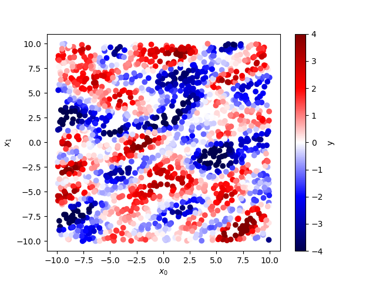
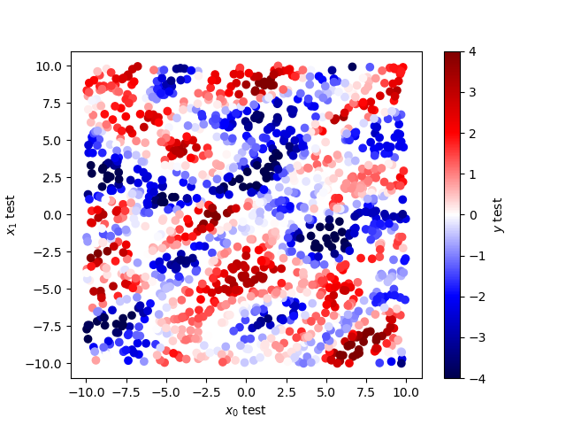

################
Gaussian Process interpolation using treegp
################

Quick start
===========

Here is a simple example of a 2D gaussian process interpolation 
using ``treegp``. Before showing how to use ``treegp``, the interpolation needs 
to be perform over some data and we will simulate some Gaussian random field below. 
In the block bellow you can find how: 

- How to generate a 2d anisotropic gaussian random field
- How to write the correlation length matrix in terms of the isotropic correlation lenght and shear parameters (:math:`g_1`, :math:`g_1`); see `Léget et al 2021 <https://doi.org/10.1051/0004-6361/202140463>`_

.. code:: ipython3

    import numpy as np
    import treegp
    from treegp import AnisotropicRBF
    import matplotlib.pyplot as plt

    def get_correlation_length_matrix(size, g1, g2):
        """
        Produce correlation matrix to introduce anisotropy in kernel.
        Used same parametrization as shape measurement in weak-lensing
        because this is mathematicaly equivalent (anistropic kernel
        will have an elliptical shape).

        :param correlation_length: Correlation lenght of the kernel.
        :param g1, g2:             Shear applied to isotropic kernel.
        """
        if abs(g1) > 1:
            g1 = 0
        if abs(g2) > 1:
            g2 = 0
        g = np.sqrt(g1**2 + g2**2)
        q = (1 - g) / (1 + g)
        phi = 0.5 * np.arctan2(g2, g1)
        rot = np.array([[np.cos(phi), np.sin(phi)], [-np.sin(phi), np.cos(phi)]])
        ell = np.array([[size**2, 0], [0, (size * q) ** 2]])
        L = np.dot(rot.T, ell.dot(rot))
        return L

    def make_2d_grf(kernel, noise=None, seed=42, npoints=40):
        """
        Function to generate a 2D gaussian random field for a
        given scikit-learn kernel.

        :param kernel:  given sklearn kernel.
        :param noise:   float. Level of noise to add to the
                        gaussian randomn field. (default: None)
        :param seed:    int. seed of the random process. (default: 42)
        :param npoints: int. number of points to generate for the
                        simulations.
        """
        # fixing the seed
        np.random.seed(seed)
        # generate random 2D coordinate
        x1 = np.random.uniform(-10, 10, npoints)
        x2 = np.random.uniform(-10, 10, npoints)
        x = np.array([x1, x2]).T
        # creating the correlation matrix / kernel
        K = kernel.__call__(x)
        # generating gaussian random field
        y = np.random.multivariate_normal(np.zeros(npoints), K)
        if noise is not None:
            # adding noise
            y += np.random.normal(scale=noise, size=npoints)
            y_err = np.ones_like(y) * noise
            return x, y, y_err
        else:
            return x, y, None

    L = get_correlation_length_matrix(2., 0.3, 0.3)
    invL = np.linalg.inv(L)
    kernel = 2**2 * AnisotropicRBF(invLam=invL)
    x, y, y_err = make_2d_grf(kernel, noise=0.1, seed=42, npoints=2000)
    plt.scatter(x[:,0], x[:,1], c=y, cmap=plt.cm.seismic, vmin=-4, vmax=4)
    cb = plt.colorbar()
    cb.set_label('y')
    plt.xlabel('$x_0$')
    plt.ylabel('$x_1$')

To do the gaussian process interpolation with ``treegp`` it follow this API: 

.. code:: ipython3

    kernel_treegp = "2**2 * AnisotropicRBF(invLam={0!r})".format(invL)

    gp = treegp.GPInterpolation(
                kernel=kernel_treegp,
                optimizer="anisotropic",
                normalize=True,
                nbins=21,
                min_sep=0.0,
                max_sep=1.0,
                p0=[6., 0.0, 0.0],
            )
    # feed with data treegp
    gp.initialize(x, y, y_err=y_err)
    # solve for hyperparameters 
    gp.solve()

    # test on test position and compute GP interpolation on it.
    x1_test = np.random.uniform(-10, 10, 1500)
    x2_test = np.random.uniform(-10, 10, 1500)
    x_test = np.array([x1_test, x2_test]).T
    y_test, y_test_cov = gp.predict(x_test, return_cov=True)

